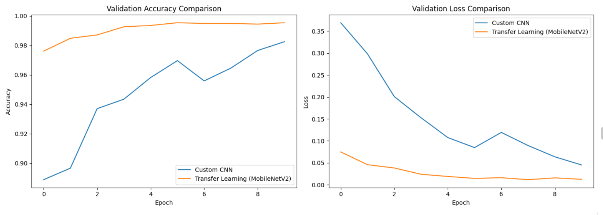
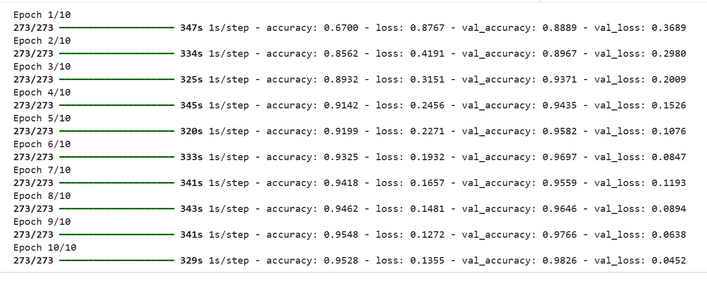
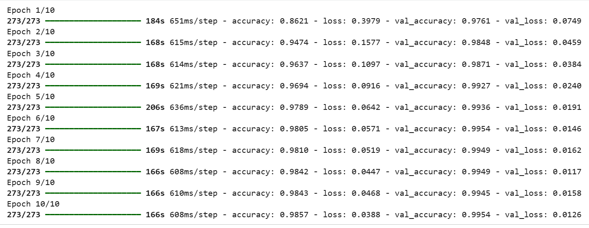
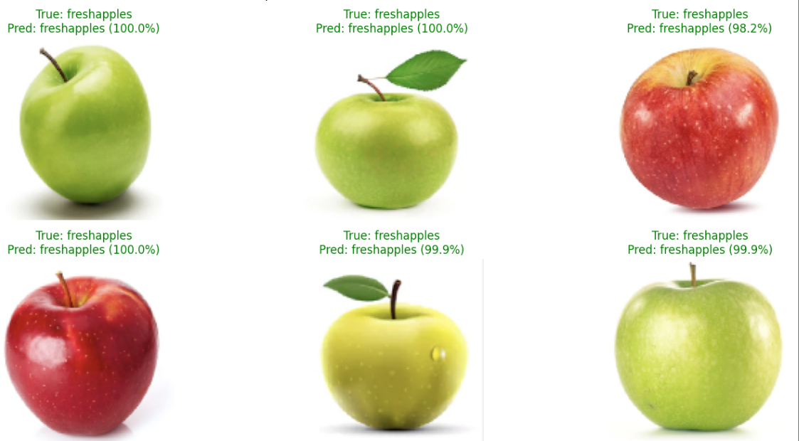
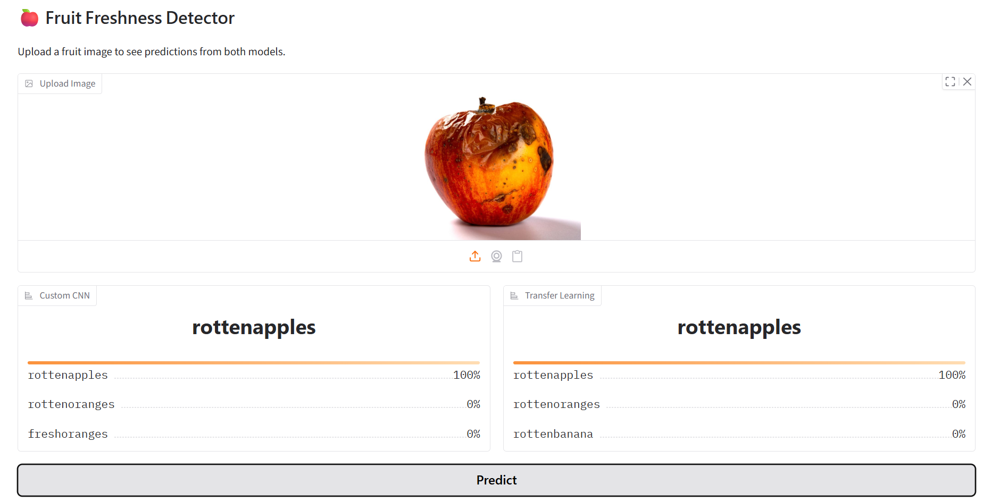
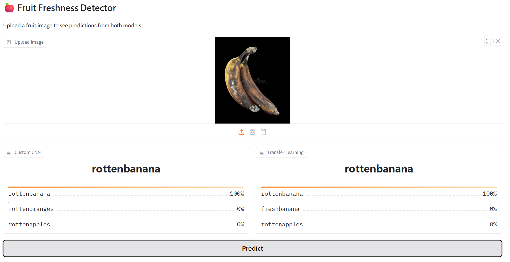
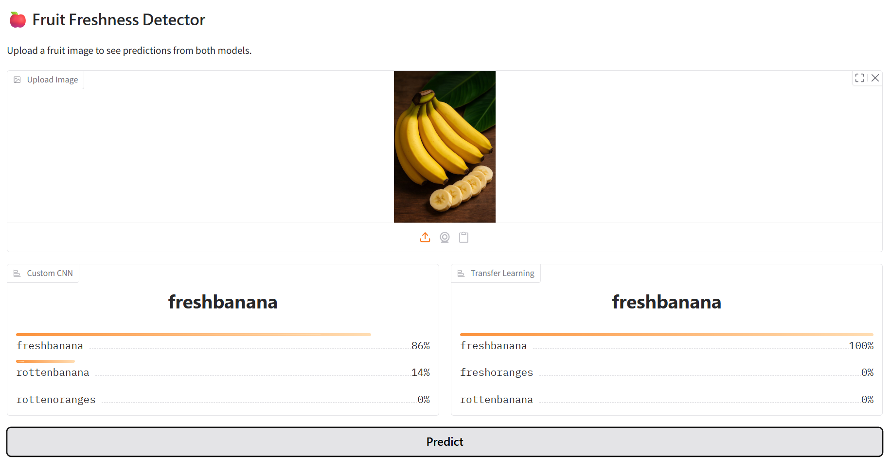

# 🍎 Fruit Freshness Detection

A deep learning project that classifies fruit images as **Fresh** or **Rotten** across 6 categories (apples, bananas, oranges). Built with two approaches — a custom CNN from scratch and a transfer learning model using MobileNetV2 — to compare performance.

## 📌 Problem Statement
Food quality control often relies on manual inspection, which is slow and inconsistent. This project automates fruit freshness detection using computer vision, helping reduce food waste and support quality control processes.

## 🧠 Approach
Two models were trained and compared:
1. **Custom CNN** — built from scratch with Conv2D, MaxPooling, and Dense layers
2. **Transfer Learning (MobileNetV2)** — pretrained on ImageNet, fine-tuned on this dataset

## 📊 Dataset
[Fruits Fresh and Rotten for Classification](https://www.kaggle.com/datasets/sriramr/fruits-fresh-and-rotten-for-classification) — 6 classes: fresh/rotten apples, bananas, and oranges.

## 🏗️ Model Architectures

**Custom CNN:**
- 3 Conv2D + MaxPooling blocks (32 → 64 → 128 filters)
- Flatten → Dense(128) → Dropout(0.5) → Dense(6, softmax)

**Transfer Learning:**
- MobileNetV2 base (frozen, pretrained on ImageNet)
- GlobalAveragePooling2D → Dense(64) → Dropout(0.5) → Dense(6, softmax)

## 📈 Results

| Model | Test Accuracy | Test Loss |
|---|---|---|
| Custom CNN | 97.00% | 0.0824 |
| Transfer Learning (MobileNetV2) | 98.78% | 0.0284 |

Transfer learning outperformed the custom CNN with higher accuracy, lower loss, and faster, more stable convergence — demonstrating the benefit of pretrained feature extractors when working with a moderately sized dataset.

**Accuracy & Loss comparison across epochs:**



**Training logs — Custom CNN:**



**Training logs — Transfer Learning:**



**Sample predictions on test set (true label vs predicted label):**



## 🚀 Live Demo (Gradio)

The trained models were tested on random fruit images sourced from the internet (outside the training/test dataset) using a Gradio interface.

Rotten Apple:


Rotten Banana:


Fresh Banana:


All three predictions matched the actual fruit condition, demonstrating the model generalizes well to real-world images outside the training/test dataset.

## 📁 Project Structure

```
fruit-freshness-detection/
├── README.md
├── requirements.txt
├── .gitignore
├── notebooks/
│   └── fruit_freshness_detection.ipynb
├── images/
│   ├── accuracy_loss_comparison.png
│   ├── training_log_custom_cnn.png
│   ├── training_log_transfer_model.png
│   ├── sample_predictions.png
│   ├── gradio_test_rottenapple.png
│   ├── gradio_test_rottenbanana.png
│   └── gradio_test_freshbanana.png
└── models/
    ├── custom_cnn_model.h5
    └── transfer_model.h5
```

## 🛠️ How to Run

1. Clone this repo:
   ```bash
   git clone https://github.com/your-username/fruit-freshness-detection.git
   cd fruit-freshness-detection
   ```

2. Install dependencies:
   ```bash
   pip install -r requirements.txt
   ```
**Note:** A plain Python script version of the full notebook is also available at `src/fruit_freshness_detection.py`, for anyone who prefers running the code outside Jupyter/Colab.
3. Open `notebooks/fruit_freshness_detection.ipynb` in Jupyter or Google Colab and run all cells.

4. To try the Gradio demo, run the last cell in the notebook — it launches an interactive web UI where you can upload any fruit image and get predictions from both models.

## 🖥️ Tech Stack
- TensorFlow / Keras
- MobileNetV2 (Transfer Learning)
- Gradio (interactive UI)
- Matplotlib (visualization)
- NumPy

## 🔮 Future Improvements
- Add more fruit types beyond apples, bananas, and oranges
- Deploy as a permanent web app (Hugging Face Spaces)
- Fine-tune the deeper layers of MobileNetV2 instead of freezing all of them
- Expand the dataset with more real-world (non-lab) images for better generalization

## 📄 License
This project is open source under the MIT License.
